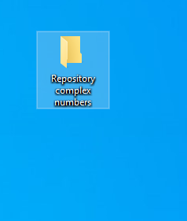

# Classic to quantum.


## Getting Started

In order to use the following functions you´ll need to use tuples instead of the normal structure of the complex numbers the following example will guide you on how to convert normal expression into tuples.
```
3+2i->( real, imaginary )
(3,2)
```

For more examples use the test file [ClassicTest.py ](https://github.com/Diegoruro/CNYT/blob/master/ClassicToQuantum/ClassicTest.py).
## Prerequisites
- [Python](https://www.python.org/) version 3.7 or higher
- [Git](https://git-scm.com/)
- [pyCharm](https://www.jetbrains.com/es-es/pycharm/)
- Matplotlib and numpy libraries

To use this library you need python, at least 3.7 version, if you already have python installed, to check if it is 3.7 or higher use the following command in cmd.

```
python --version
```

### Installing

These are the instructions to use the library.
follow the step by step to install the library.

copy the link of the repository with the following steps:

 - Get into the main git of the repository.

 - Copy the URL of the repository by clicking the code button and copy button.

 - Create a folder where you want to save the repository and open it.


 - Right click in the folder and use the option "Git Bash Here".

 - Use the following command to copy the repository with the URL you already copy from Github.

```
git clone https://github.com/Diegoruro/ComplexCNYT.git
```

 - Then the repository will be in your new folder ready to use it.


## Running the tests

To run the test of the library you´ll need to open the following file.
```
ClassicTest.py
```
It will show you some test of every function of the library.

The following steps will show you how to run it with [pyCharm](https://www.jetbrains.com/es-es/pycharm/)

- Open the file [ClassicTest.py ](https://github.com/Diegoruro/CNYT/blob/master/ClassicToQuantum/ClassicTest.py) with [pyCharm](https://www.jetbrains.com/es-es/pycharm/).


- Then look for the line number 82, right click on the green play button and click on Run option


That´s all.
### Files
- [ClassicToQuantum.py ](https://github.com/Diegoruro/CNYT/blob/master/ClassicToQuantum/ClassicToQuantum.py)
- [ClassicTest.py ](https://github.com/Diegoruro/CNYT/blob/master/ClassicToQuantum/ClassicTest.py)

## Folders
- [Images](https://github.com/Diegoruro/ComplexCNYT/tree/master/Images): contains the images used in the Readme file.

## Built With

* [Python 3.8](https://www.python.org/) - As the main programming language.


## Authors

* **Diego Ruiz Rojas** - *main work* - [github](https://github.com/Diegoruro)

student at:[Escuela Colombiana de Ingeniería Julio Garavito](https://www.escuelaing.edu.co/es/)
