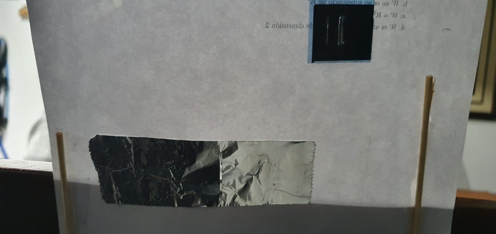
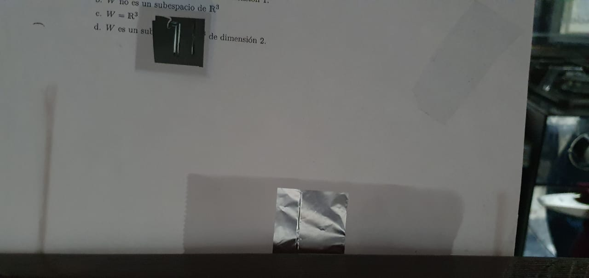

# Double Slit Experiment.

This experiment allow us to understand the basic principle of quantum mechanics.

## Materials

In order to perform this experiment we need the following materials.
- Aluminum foil
- Scalpels
- A sheet of paper
- A laser pointer

### Double slit model.

The following construction is a model of a Double slit and in order to perform this experiment we need to make it.

 
## Running the Experiment

To run the Experiment we need to use the laser pointer aiming to the two slits of the aluminium foil and this will be the result.

## Folders
- [Images](https://github.com/Diegoruro/ComplexCNYT/tree/master/Images): contains the images used in the Readme file.

## Simulation with libraries.
In order to simulate the experiment in a common computer we will use the [ClassicToQuantum](https://github.com/Diegoruro/CNYT/tree/master/ClassicToQuantum) folder which has the libraries to perform the simulation of this experiment.

## Authors

* **Diego Ruiz Rojas** - *main work* - [github](https://github.com/Diegoruro)

student at:[Escuela Colombiana de Ingeniería Julio Garavito](https://www.escuelaing.edu.co/es/)
