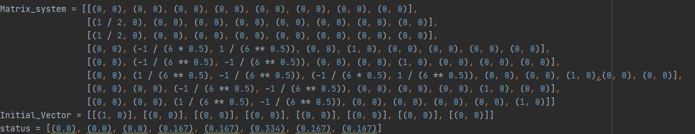

# Double Slit Experiment.

This experiment allow us to understand the basic principle of quantum mechanics.

In the experiment, a laser was used to cast a beam of light onto an aluminum foil plate. If this has a single opening or slit then we will have the projection of a single point the light passes through a single slit, if we change a bit of the system using two slits the projection will be different from the first projection , it will show like the laser beam is expanded accross a horizontal line, this will be explained from the quantum mechanics.

## Explanation
When a photon from the laser beam passes through the two slits, it appears that it is in two different places at the same time, this is due to interference between waves equations

The following videos will explain better the objective of the experiment and why this happen.

https://www.youtube.com/watch?v=Y9ScxCemsPM&ab_channel=QuantumFracture

https://www.youtube.com/watch?v=r2vlr2LyUnw&ab_channel=QuantumFracture
## Materials

In order to perform this experiment we need the following materials.
- Aluminum foil
- Scalpels
- A sheet of paper
- A laser pointer


### Double slit model.

The following construction is a model of a Double slit and in order to perform this experiment we need to make it.


 
## Running the Experiment

To run the Experiment we need to use the laser pointer aiming to the two slits of the aluminium foil and this will be the result.


## Folders
- [Images](https://github.com/Diegoruro/ComplexCNYT/tree/master/Images): contains the images used in the Readme file.

## Simulation with libraries.
In order to simulate the experiment in a common computer we will use the [ClassicToQuantum](https://github.com/Diegoruro/CNYT/tree/master/ClassicToQuantum) folder which has the libraries to perform the simulation of this experiment.

Ussing the following function we can simulate the experiment
```
matriz_complex(mat, vect, clicks):
```
Using the following matrix and inital vector with at least two clicks the simulation give us the status of the probability of the experiment.



## Authors

* **Diego Ruiz Rojas** - *main work* - [github](https://github.com/Diegoruro)

student at:[Escuela Colombiana de Ingeniería Julio Garavito](https://www.escuelaing.edu.co/es/)
