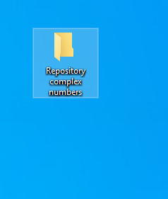
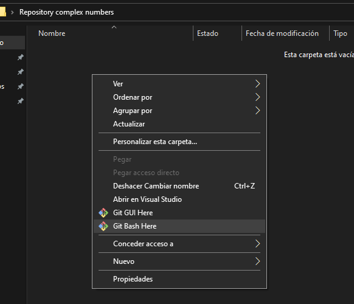
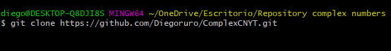
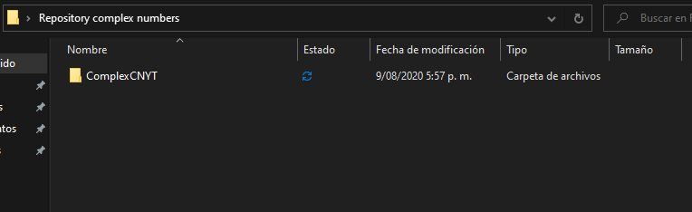

# Operations of complex numbers

This is a repository for a library that has the functions to complete basic operations with complex numbers, developed with python language

## Getting Started

To use this library you will need Python installed in your computer

### Prerequisites

To use this library you need python, at least 3.7 version, if you already have python installed, to check if it is 3.7 or higher use the following command in cmd.
always you´ll need git already installed in your computer.

```
python --version
```

### Installing

These are the instructions to use the library.
follow the step by step to install the library.

copy the link of the repository with the following steps:

 - Get into the main git of the repository

 - copy the URL of the repository by clicking the code button and copy button

 - Create a folder where you want to save the repository and open it


 - right click in the folder and use the option "Git Bash Here"

 - use the following command to copy the repository with the URL you already copy from Github

```
git clone https://github.com/Diegoruro/ComplexCNYT.git
```

 - then the repository will be in your new folder ready to use it.


## Running the tests

To run the test of the library you´ll need to open the following file.
```
Pruebas.py
```
It will show you some test of every function of the library.

### Files
- [Complejos.py](https://github.com/Diegoruro/ComplexCNYT/blob/master/Pruebas.py)
- [pruebas.py](https://github.com/Diegoruro/ComplexCNYT/blob/master/Pruebas.py)

## Folders
- [Images](https://github.com/Diegoruro/ComplexCNYT/tree/master/Images): contains the images used in the Readme file

## Built With

* [Python 3.8](https://www.python.org/) - As the main programming language.


## Authors

* **Diego Ruiz Rojas** - *Initial work* - [PurpleBooth](https://github.com/PurpleBooth)
student at:[Escuela Colombiana de Ingeniería Julio Garavito](https://www.escuelaing.edu.co/es/)
